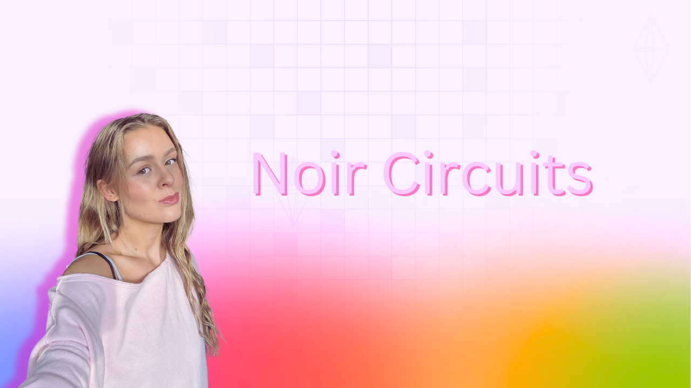

> ⚠️ **Important:** If you're looking for the [foundry-full-course](https://github.com/Cyfrin/foundry-full-course-cu) or [moccasin-full-course](https://github.com/Cyfrin/moccasin-full-course-cu) you can find them here:
> 
> [Foundry/Solidity: https://github.com/Cyfrin/foundry-full-course-cu](https://github.com/Cyfrin/foundry-full-course-cu)
> 
> [Moccasin/Vyper: https://github.com/Cyfrin/moccasin-full-course-cu](https://github.com/Cyfrin/moccasin-full-course-cu)

[contributors-shield]: https://img.shields.io/github/contributors/cyfrin/developer-zk-circuits-with-noir-cu.svg?style=for-the-badge
[contributors-url]: https://github.com/cyfrin/developer-zk-circuits-with-noir-cu/graphs/contributors
[forks-shield]: https://img.shields.io/github/forks/cyfrin/developer-zk-circuits-with-noir-cu.svg?style=for-the-badge
[forks-url]: https://github.com/cyfrin/developer-zk-circuits-with-noir-cu/network/members
[stars-shield]: https://img.shields.io/github/stars/cyfrin/developer-zk-circuits-with-noir-cu.svg?style=for-the-badge
[stars-url]: https://github.com/cyfrin/developer-zk-circuits-with-noir-cu/stargazers
[issues-shield]: https://img.shields.io/github/issues/cyfrin/developer-zk-circuits-with-noir-cu.svg?style=for-the-badge
[issues-url]: https://github.com/cyfrin/developer-zk-circuits-with-noir-cu/issues
[license-shield]: https://img.shields.io/github/license/cyfrin/developer-zk-circuits-with-noir-cu.svg?style=for-the-badge
[license-url]: https://github.com/cyfrin/developer-zk-circuits-with-noir-cu/blob/master/LICENSE.txt
[linkedin-shield]: https://img.shields.io/badge/-LinkedIn-black.svg?style=for-the-badge&logo=linkedin&colorB=555

<h1> Noir ZK Circuit Developer </h1>

<strong> An introduction to building circuits using Noir and using them to build on-chain privacy projects.
</strong>

[![Stargazers][stars-shield]][stars-url] [![Forks][forks-shield]][forks-url]
[![Contributors][contributors-shield]][contributors-url]
[![Issues][issues-shield]][issues-url]
[![MIT License][license-shield]][license-url]

     
    

     

Welcome to the repository for the Noir Circuit Development Course

This repository houses course resources and [discussions](https://github.com/Cyfrin/develop-zk-circuits-with-noir-cu/discussions) for the course.

Please refer to this for an in-depth explanation of the content:

- [Website](https://updraft.cyfrin.io) - Join Cyfrin Updraft and enjoy 50+ hours of smart contract development courses
- [Twitter](https://twitter.com/CyfrinUpdraft) - Stay updated with the latest course releases
- [LinkedIn](https://www.linkedin.com/school/cyfrin-updraft/) - Add Updraft to your learning experiences
- [Discord](https://discord.gg/cyfrin) - Join a community of 3000+ developers and auditors
- [Newsletter](https://cyfrin.io/newsletter) - Weekly security research tips and resources to level up your career
- [Codehawks](https://codehawks.com) - Smart contracts auditing competitions to help secure web3
<!-- *Lol, my t-shirt is backwards in 2 of them* -->

 

 

Cyfrin Updraft Courses:

- [Cyfrin Updraft - Develop ZK Circuits with Noir ](https://updraft.cyfrin.io/courses/developer-zk-circuits-with-noir)

[YouTube Link]()

# Disclaimer 

> ⚠️ All code associated with this course is for demo purposes only. They have not been audited and should not be considered production ready. Please use at your own risk.

The following content is provided strictly for educational purposes. This course demonstrates how privacy-preserving smart contracts like mixers work under the hood using zero-knowledge proofs.
It is not intended to promote or encourage the use of privacy tools for illicit activity.
We do not condone the violation of any laws or regulations. Please ensure you comply with your local laws when building or deploying smart contracts.

By continuing with this course, you acknowledge that the code and concepts shared are for learning only, and you accept full responsibility for how you use them.

# Resources For This Course

- AI Frens
  - [ChatGPT](https://chat.openai.com/)
    - Just know that it will often get things wrong, but it's very fast!
  - [Phind](https://www.phind.com/)
    - Like ChatGPT, but it searches the web
  - [Bard](https://bard.google.com/)
  - [Other AI extensions](https://twitter.com/aisolopreneur/status/1654823630155464704?s=42&t=-pu_sCYtfrfPJU7OXfifrQ)
- [Github Discussions](https://github.com/Cyfrin/developer-zk-circuits-with-noir-cu/discussions)
  - Ask questions and chat about the course here!
- [Stack Exchange Ethereum](https://ethereum.stackexchange.com/)
  - Great place for asking technical questions about Ethereum
- [Peeranha](https://peeranha.io/)
  - Decentralized Stack Exchange!
- [Cookbook](./cookbook-listings.md)
  - A smart contract registry and co-pilot

# Section 1: Welcome to Noir

## Welcome

_[⌨️  Welcome](https://updraft.cyfrin.io/courses/developer-zk-circuits-with-noir/welcome-to-noir/welcome)_

## Introduction and Prerequisites

_[⌨️  Introduction and Prerequisites](https://updraft.cyfrin.io/courses/developer-zk-circuits-with-noir/welcome-to-noir/introduction-and-prerequisites)_

## Meet the Instructor

_[⌨️  Meet the Instructor](https://updraft.cyfrin.io/courses/developer-zk-circuits-with-noir/welcome-to-noir/meet-the-instructor)_

## Why take this Course

_[⌨️  Why take this Course](https://updraft.cyfrin.io/courses/developer-zk-circuits-with-noir/welcome-to-noir/why-take-this-course)_

## Course Navigation

_[⌨️  Course Naviagation](https://updraft.cyfrin.io/courses/developer-zk-circuits-with-noir/welcome-to-noir/course-navigation)_

# Section 2: ZK ECRecover

💻 Code: https://github.com/Cyfrin/zk-ecrecover-cu

## Intro to Noir

_[⌨️  Intro to Noir](https://updraft.cyfrin.io/courses/developer-zk-circuits-with-noir/zk-ecrecover/intro-to-noir)_

- [Noir documentation](https://noir-lang.org/docs)

## Noir Architecture

_[⌨️  Noir Architecture](https://updraft.cyfrin.io/courses/developer-zk-circuits-with-noir/zk-ecrecover/noir-architecture)_

## ZK Protocol Architecture

_[⌨️  ZK Protocol Architecture](https://updraft.cyfrin.io/courses/developer-zk-circuits-with-noir/zk-ecrecover/zk-protocol-architecture)_

## Nargo and Barretenberg Installation

_[⌨️  Nargo and Barretenberg Installation](https://updraft.cyfrin.io/courses/developer-zk-circuits-with-noir/zk-ecrecover/nargo-and-barretenberg-installation)_

- [Barretenberg Repo and Docs](https://github.com/AztecProtocol/aztec-packages/tree/master/barretenberg)

## Creating a Noir Project

_[⌨️  Creating a Noir Project](https://updraft.cyfrin.io/courses/developer-zk-circuits-with-noir/zk-ecrecover/creating-a-noir-project)_

## Noir Project Types and Layout

_[⌨️  Noir Project Types and Layout](https://updraft.cyfrin.io/courses/developer-zk-circuits-with-noir/zk-ecrecover/noir-project-types-and-layout)_

- [Noir crate types](https://noir-lang.org/docs/noir/modules_packages_crates/crates_and_packages)

## Noir Data Types

_[⌨️  Noir Data Types](https://updraft.cyfrin.io/courses/developer-zk-circuits-with-noir/zk-ecrecover/noir-data-types)_

- [Noir Data types](https://noir-lang.org/docs/noir/concepts/data_types)

## Assert and Test Functions

_[⌨️  Assert and Test Functions](https://updraft.cyfrin.io/courses/developer-zk-circuits-with-noir/zk-ecrecover/assert-and-test-functions)_

## Creating and Verifying a Proof Off-chain

_[⌨️  Creating and Verifying a Proof Off-chain](https://updraft.cyfrin.io/courses/developer-zk-circuits-with-noir/zk-ecrecover/creating-and-verifying-a-proof-off-chain)_

## Using Dependencies in Noir

_[⌨️  Using Dependencies in Noir](https://updraft.cyfrin.io/courses/developer-zk-circuits-with-noir/zk-ecrecover/using-dependencies-in-noir)_

- [ECRecover repo](https://github.com/colinnielsen/ecrecover-noir)

## Writing a Signature Verification Circuit

_[⌨️  Writing a Signature Verification Circuit](https://updraft.cyfrin.io/courses/developer-zk-circuits-with-noir/zk-ecrecover/writing-a-signature-verification-circuit)_

## Creating the Noir ECDSA Inputs

_[⌨️  Creating the Noir ECDSA Inputs](https://updraft.cyfrin.io/courses/developer-zk-circuits-with-noir/zk-ecrecover/creating-noir-ecdsa-inputs)_

## ECDSA Proof and Verifier Contract 

_[⌨️  ECDSA Proof and Verifier Contract ](https://updraft.cyfrin.io/courses/developer-zk-circuits-with-noir/zk-ecrecover/ecdsa-proof-and-verifier-contract)_

## Noir ECDSA Summary 

_[⌨️  Noir ECDSA Summary ](https://updraft.cyfrin.io/courses/developer-zk-circuits-with-noir/zk-ecrecover/noir-ecdsa-summary)_

# Section 3: ZK Panagram App

💻 Code: https://github.com/Cyfrin/zk-panagram-cu

## Introduction

_[⌨️  Introduction](https://updraft.cyfrin.io/courses/developer-zk-circuits-with-noir/zk-panagram-app/introduction)_

## Panagram Project Walkthrough

_[⌨️  Panagram Project Walkthrough](https://updraft.cyfrin.io/courses/developer-zk-circuits-with-noir/zk-panagram-app/panagram-project-walkthrough)_

## Creating the Panagram Circuit

_[⌨️  Creating the Panagram Circuit](https://updraft.cyfrin.io/courses/developer-zk-circuits-with-noir/zk-panagram-app/creating-the-panagram-circuit)_

## Panagram Contract Setup

_[⌨️  Panagram Contract Setup](https://updraft.cyfrin.io/courses/developer-zk-circuits-with-noir/zk-panagram-app/panagram-contract-setup)_

## Inhertiting ERC-1155

_[⌨️  Inhertiting ERC-1155](https://updraft.cyfrin.io/courses/developer-zk-circuits-with-noir/zk-panagram-app/inhertiting-erc-1155)_

- [Advanced Foundry NFT Section](https://updraft.cyfrin.io/courses/advanced-foundry/how-to-create-an-NFT-collection/introduction-to-nfts)

## Setting the Verifier Contract

_[⌨️  Setting the Verifier Contract](https://updraft.cyfrin.io/courses/developer-zk-circuits-with-noir/zk-panagram-app/setting-the-verifier-contract)_

## Writing the Panagram Contract Functions

_[⌨️  Writing the Panagram Contract Functions](https://updraft.cyfrin.io/courses/developer-zk-circuits-with-noir/zk-panagram-app/writing-the-panagram-contract-functions)_

## Compiling the Panagram Contract

_[⌨️  Compiling the Panagram Contract](https://updraft.cyfrin.io/courses/developer-zk-circuits-with-noir/zk-panagram-app/compiling-the-panagram-contract)_

## Starting the Tests

_[⌨️  Starting the Tests](https://updraft.cyfrin.io/courses/developer-zk-circuits-with-noir/zk-panagram-app/starting-the-tests)_

- [Modular Arithmetic Video](https://www.youtube.com/watch?v=mBDaDGBOu-E)
- [Field Video](https://www.youtube.com/watch?v=7XNnds4JKZw)

## Running Scripts in Forge Tests

_[⌨️  Running Scripts in Forge Tests](https://updraft.cyfrin.io/courses/developer-zk-circuits-with-noir/zk-panagram-app/running-scripts-in-forge-tests)_

## Setting up the Generate Proof Script

_[⌨️  Setting up the Generate Proof Script](https://updraft.cyfrin.io/courses/developer-zk-circuits-with-noir/zk-panagram-app/setting-up-the-generate-proof-script)_

## Get Proof Function

_[⌨️  Get Proof Function](https://updraft.cyfrin.io/courses/developer-zk-circuits-with-noir/zk-panagram-app/get-proof-function)_

## Writing the Proof Script

_[⌨️  Writing the Proof Script](https://updraft.cyfrin.io/courses/developer-zk-circuits-with-noir/zk-panagram-app/writing-the-proof-script)_

## Finishing the Tests

_[⌨️  Finishing the Tests](https://updraft.cyfrin.io/courses/developer-zk-circuits-with-noir/zk-panagram-app/finishing-the-tests)_

## Panagram Recap

_[⌨️  Panagram Recap](https://updraft.cyfrin.io/courses/developer-zk-circuits-with-noir/zk-panagram-app/panagram-recap)_

## Frontend Walkthrough

_[⌨️  Frontend Walkthrough](https://updraft.cyfrin.io/courses/developer-zk-circuits-with-noir/zk-panagram-app/frontend-walkthrough)_

## Fixing Bugs

_[⌨️  Fixing Bugs](https://updraft.cyfrin.io/courses/developer-zk-circuits-with-noir/zk-panagram-app/fixing-bugs)_

- [Keccak dependency](https://github.com/noir-lang/keccak256)

## Summary

_[⌨️  Summary](https://updraft.cyfrin.io/courses/developer-zk-circuits-with-noir/zk-panagram-app/summary)_

# Section 4: ZK Mixer

💻 Code: https://github.com/Cyfrin/zk-mixer-cu

# References

The following resources were consulted in creating this course:

- [Noir Documentation](https://noir-lang.org/docs)
- [Porter's live stream on Tornado Cash](https://www.youtube.com/live/jGmvJZ7m7WU)
- [Rare skills article](https://www.rareskills.io/post/how-does-tornado-cash-work)
- [Artem Chystiakov's article](https://medium.com/distributed-lab/cartesian-merkle-tree-the-new-breed-a30b005ecf27)
- [Smart Contract Programmer's video](https://www.youtube.com/watch?v=z_cRicXX1jI)
- https://www.researchgate.net/figure/Example-of-the-Tornado-Cash-1-ETH-pool-addresses-A-through-F-deposit-to-and-withdraw_fig1_357925591
- [Krishang's Tornado Cash Rebuilt Repo](https://github.com/nkrishang/tornado-cash-rebuilt/tree/main)
- [The Tornado Cash codebase](https://github.com/tornadocash)
- [Cat Mcgee's Private Peace Hackathon Project](https://github.com/catmcgee/the-private-peace-project/tree/master)

# Disclosures

Transparency is important! So we want to disclose any potential conflicts that might have affected my judgement so you can pick tools that are right for you. Patrick is co-founder of Alpha Chain, a blockchain infrastructure company. Alpha Chain runs **Chainlink, Ethereum, Binance, Polygon, Harmony, Solana, Moonbeam, and Moonriver blockchain services.** Alpha Chain often works with Alchemy and receives discounted services. Patrick is the co-founder of Cyfrin, and they do smart contract security & auditing services. Patrick is also the co-founder of Chain Accel, who is an advisor on the Peeranha project.

Because of all this, I have added alternatives to each section where we suggest a tool.

# Sponsors

A huge thank you to our sponsors. These are the groups and technologies

# Thank you

Thanks to everyone who is taking, participating in, and working on this course. It's been a passion project and a data dump of everything I've learnt in the web3 space to get you up to speed quickly. Also, a big thank you to Cyfrin & Chain Accel for encouraging this course to come to light, and many, many, many people from the community.

And thanks to the [Cyfrin](https://www.cyfrin.io/) team for making this possible!

## License

Cyfrin Updraft content is open-sourced [licensed as GPLv3](https://github.com/cyfrin/developer-zk-circuits-with-noir-cu/blob/main/LICENSE).

(<a href="#table-of-contents">back to top</a>) ⬆️

